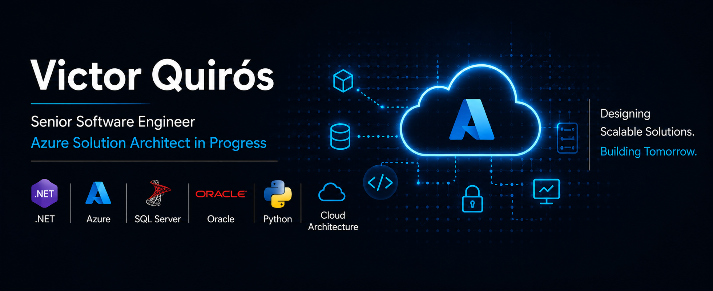

  

# Hi, I'm Victor Quirós 👋

### Senior Software Engineer | Azure Cloud & Solution Architecture

Building enterprise software, cloud solutions, and data-driven applications with .NET, Python, Azure, and SQL Server.

---

## About Me

I am a Senior Software Engineer with over 10 years of experience designing enterprise applications, backend systems, and relational databases.

Throughout my career, I have worked on software architecture, API development, database optimization, and cloud solutions for business-critical systems.

Today my primary focus is designing cloud-native applications on Microsoft Azure using Clean Architecture, Infrastructure as Code, CI/CD, and modern observability practices.

My professional background includes:

* Enterprise software development
* Relational database design and optimization
* Backend systems and APIs
* Cloud technologies and Azure services
* System analysis and technical architecture

Currently, I am focused on expanding my expertise in Azure architecture and cloud-native solutions with the goal of becoming a Solution Architect.

---

## Certifications

  
  

---

## Technology Stack

### Programming Languages

  

- C#
- Python
- TypeScript
- JavaScript
- SQL

---

### Frameworks & Backend

  

- ASP.NET Core
- FastAPI
- REST APIs
- React
- JWT Authentication
- Microsoft Entra ID

---

### Cloud, DevOps & Infrastructure

  

- Microsoft Azure
- Azure Functions
- Azure App Service
- Azure Storage
- Azure Queue Storage
- GitHub Actions
- Docker
- Bicep (Infrastructure as Code)
  
---

### Databases

  
  
  
  

- Microsoft SQL Server
- Oracle Database
- MySQL
- MariaDB
- Database Design
- Query Optimization
- Performance Tuning
- Stored Procedures
- Data Modeling

---

## Featured Projects

### Enterprise Log Analyzer

Cloud-native log processing platform built on Azure for scalable ingestion, normalization, and analysis of application logs.

The solution follows an event-driven architecture using Azure Functions, Queue Storage, Docker, and Infrastructure as Code.

**Highlights**

- Azure Functions
- Queue Storage
- Event-driven processing
- Docker
- Bicep
- GitHub Actions

**Repository:** https://github.com/quirosmirandavictor/logs_viewer

---

### Property Management Platform

Commercial-oriented Property Management platform built as a Modular Monolith following Clean Architecture principles.

Designed to support rental property administration while providing a scalable foundation for future cloud deployment on Azure.

**Highlights**

- Modular Monolith Architecture
- FastAPI backend
- React frontend
- JWT Authentication
- SQL Database
- CI/CD ready
- Azure deployment roadmap

**Repository:** https://github.com/quirosmirandavictor/property_management

---

## Current Focus

- Azure Solution Architecture
- Cloud-Native Applications
- Clean Architecture
- Modular Monolith Architecture
- Event-Driven Architecture
- Distributed Systems
- Infrastructure as Code (Bicep)
- CI/CD Automation
- Exploring Microservices and Service-Oriented Architectures
- SaaS Product Development

---

## Current Learning Journey

- Microsoft Azure Solution Architecture (AZ-305)
- Azure Well-Architected Framework
- Infrastructure as Code with Bicep
- Event-Driven Architecture
- Modular Monolith Architecture
- Cloud Design Patterns
- Distributed Systems
- OpenTelemetry & Observability
- OpenID Connect & Modern Authentication

---
<!-- METRICS:START -->

<!-- METRICS:END -->
---

## Contribution Activity

---

## Goals for 2026

- Earn Microsoft AZ-305 certification
- Launch a commercial SaaS platform
- Expand expertise in Azure architecture and distributed systems
- Build production-ready cloud solutions following Well-Architected principles

---

## Areas of Interest

- Cloud Architecture
- Azure
- Clean Architecture
- Distributed Systems
- SaaS Platforms
- DevOps
- Observability
- Backend Engineering

---

## Connect With Me

  

---

> “Designing reliable software today while building scalable cloud solutions for tomorrow.”
