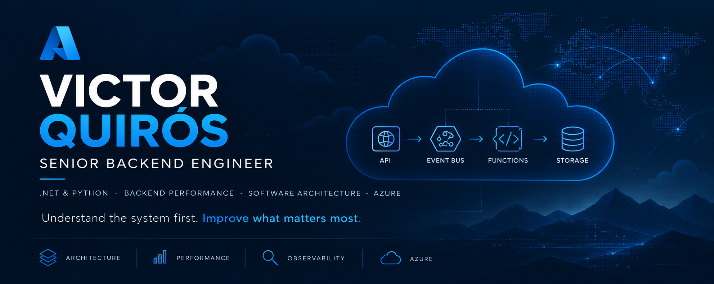

  

# Hi, I'm Victor Quirós 👋

### Senior Backend Engineer | .NET & Python | Backend Performance | Software Architecture | Azure

I build and improve enterprise backend systems with a focus on maintainability,
performance, architecture, observability, and incremental modernization.

[Portfolio](https://vqm-engineering.vercel.app/) ·
[Consulting](https://vqm-engineering.vercel.app/docs/consulting) ·
[LinkedIn](https://www.linkedin.com/in/victor-quiros-miranda-az)

---

## About Me

I am a Senior Software Engineer with over 10 years of experience designing,
modernizing, and supporting enterprise applications, backend systems, and
relational databases.

Throughout my career, I have worked on software architecture, API development,
database optimization, system integration, backend performance, legacy
modernization, and cloud solutions for business-critical systems.

My current technical focus includes .NET, Python, Microsoft Azure, distributed
systems, Clean Architecture, Infrastructure as Code, CI/CD, and modern
observability practices.

A significant part of my experience has involved improving existing systems:
understanding technical constraints, identifying bottlenecks, addressing
performance issues, and defining practical improvements without defaulting
to unnecessary rewrites.

### Professional Background

- Enterprise backend development
- Software architecture and technical design
- Backend performance analysis and optimization
- Relational database design and optimization
- REST APIs and system integration
- Legacy system modernization
- Distributed systems and asynchronous processing
- Cloud technologies and Microsoft Azure
- Technical mentoring and architecture guidance

---

## Consulting

I also provide focused architecture and performance assessments for existing
.NET and Python backend systems.

Current assessment areas include:

- **Architecture & Performance Triage**  
  Identify where a technical or performance problem should be investigated first.

- **Backend Architecture Health Check**  
  Review boundaries, dependencies, data access, maintainability, observability,
  and modernization opportunities.

- **Performance Diagnostic**  
  Investigate a clearly defined performance problem such as slow batch jobs,
  timeouts, inefficient ORM usage, expensive SQL, or excessive database
  round-trips.

My approach is evidence-driven and incremental: understand the existing system,
identify the real constraints, and then define practical next steps.

➡️ [Learn more about my consulting approach](https://vqm-engineering.vercel.app/docs/consulting)

---

## Certifications

  
  

---

## Technology Stack

### Programming Languages

  

- C#
- Python
- TypeScript
- JavaScript
- SQL

### Frameworks & Backend

  

- ASP.NET Core
- FastAPI
- Flask
- React
- REST APIs
- JWT Authentication
- Microsoft Entra ID

### Cloud, DevOps & Infrastructure

  

- Microsoft Azure
- Azure Functions
- Azure App Service
- Azure Storage
- Azure Queue Storage
- Docker
- GitHub Actions
- Bicep / Infrastructure as Code

### Databases & Data Access

  
  
  
  

- Microsoft SQL Server
- Oracle Database
- MySQL / MariaDB
- Entity Framework Core
- ADO.NET
- SQLAlchemy
- Relational database design
- Query optimization
- Performance tuning
- Data modeling

---

## Featured Projects

### Enterprise Log Analyzer

Cloud-native log processing solution designed to decouple log producers from
storage and downstream processing.

The architecture uses asynchronous messaging to absorb workload variations
and allow components to evolve independently.

**Architecture focus**

- Event-driven processing
- Azure Functions
- Azure Queue Storage
- Structured log ingestion
- Docker
- Bicep
- GitHub Actions

**Key decision:** logs are published asynchronously instead of being processed
directly by the producer, reducing coupling between log generation and
persistence.

**Repository:**  
https://github.com/quirosmirandavictor/logs_viewer

---

### Nutri Metrics Platform

Nutritional tracking backend designed as a Modular Monolith using Clean
Architecture and CQRS.

The platform processes free-text food queries, integrates external nutritional
services, and keeps application concerns separated through explicit
architectural boundaries.

**Architecture focus**

- Modular Monolith
- Clean Architecture
- CQRS with MediatR
- .NET 10 Web API
- External API integrations
- Integration and unit testing
- OpenTelemetry
- Grafana observability stack

**Key decision:** a Modular Monolith was selected instead of introducing
distributed services prematurely, keeping deployment simple while preserving
clear internal boundaries.

**Repository:**  
https://github.com/quirosmirandavictor/nutri_metrics

---

### Earthquake Monitor

Earthquake monitoring platform designed to ingest, normalize, persist, and
eventually visualize seismic events from public data sources.

The backend follows a Modular Monolith and Clean Architecture approach with
explicit application boundaries.

**Architecture focus**

- Modular Monolith
- Clean Architecture
- .NET 10
- Azure Functions
- USGS GeoJSON integration
- Oracle persistence
- Idempotent UPSERT processing
- Docker and Azurite
- Oracle Wallet integration

**Key decision:** ingestion is designed to be idempotent so repeated events
from external feeds can be processed safely without creating duplicates.

**Repository:**  
https://github.com/quirosmirandavictor/earth_quake_monitor

---

### Property Management Platform

Property management platform designed to support rental administration,
contracts, financial operations, and related business workflows.

The backend is being developed as a Modular Monolith with Clean Architecture,
allowing business capabilities to remain separated without introducing
unnecessary distributed-system complexity.

**Architecture focus**

- Python / FastAPI
- Modular Monolith
- Clean Architecture
- React
- JWT Authentication
- Relational database
- Database migrations
- Azure-oriented cloud architecture

**Key decision:** documents such as contracts, invoices, and payment evidence
are designed to be stored outside the relational database, keeping only their
references and metadata in the corresponding domain entities.

**Repository:**  
https://github.com/quirosmirandavictor/property_management

---

## Current Technical Focus

I am currently deepening my hands-on experience in:

- Azure Solution Architecture
- Distributed systems and integration patterns
- Event-driven architecture
- Infrastructure as Code with Bicep
- Observability with OpenTelemetry
- Backend performance and scalability
- Cloud-native backend systems
- Legacy modernization
- SaaS product architecture

### Certification Path

- Microsoft Azure Administrator (AZ-104)
- Microsoft Azure Solutions Architect (AZ-305)
- Azure Well-Architected Framework

---

<!-- METRICS:START -->

<!-- METRICS:END -->

---

## Connect With Me

  

🌐 **Portfolio:**  
https://vqm-engineering.vercel.app/

🛠️ **Consulting:**  
https://vqm-engineering.vercel.app/docs/consulting

---

> “Understand the system first. Improve what matters most.”
